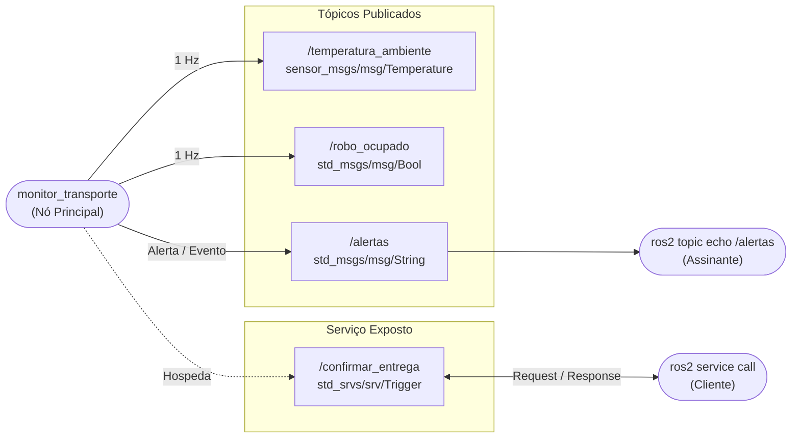

# Avaliação Teórico-Prática (AT) [OBRIGATÓRIO]
**Disciplina:** Fundamentos de Sistemas Robóticos com ROS 2  
**Aluno:** Lucas Dias de Gondra  
**E-mail:** lucas.gondra@al.infnet.edu.br  

---

### Preparação do Workspace no WSL (Ubuntu 22.04)

```bash
cd /mnt/c/Users/Lucas/Documents/codes/BlocoRobotica
cd ./FundamentosSistemasRoboticos/at/tp1_ws

source /opt/ros/humble/setup.bash
colcon build --packages-select comunicacao_ros2
source install/setup.bash
```

---

## Exercício 1: Arquitetura do sistema e comparação ROS 1 / ROS 2

### 1.1 Projeto da Arquitetura de Comunicação e Mapeamento Sensor/Atuador

A escolha dos mecanismos de comunicação (Tópico, Serviço e Ação) e das mensagens padrão do ROS 2 garante desacoplamento, previsibilidade temporal e segurança para a operação de um robô hospitalar autônomo:

| Subsistema | Sensor / Atuador | Mecanismo (tópico/serviço/ação) | Mensagem padrão | Por que não os outros |
| :--- | :--- | :--- | :--- | :--- |
| **Navegação** | LiDAR + odometria | **Tópico** | `sensor_msgs/msg/LaserScan` | Serviço bloquearia o nó e Ação traria sobrecarga desnecessária para streaming contínuo. |
| **Manipulação** | Câmera + braço | **Ação** | `control_msgs/action/FollowJointTrajectory` | Tópico não garante conclusão/feedback e Serviço bloqueia o nó sem permitir cancelamento. |
| **Comunicação** | Comunicação com equipe médica | **Serviço** | `std_srvs/srv/Trigger` | Tópico não tem confirmação/resposta imediata e Ação traz sobrecarga para comando pontual. |
| **Bateria** | Monitoramento de bateria | **Tópico** | `sensor_msgs/msg/BatteryState` | Serviço exige requisição pontual desnecessária e Ação não se aplica a telemetria periódica. |

---

### 1.2 Comparação Técnica ROS 1 vs ROS 2 em Contexto Hospitalar Crítico

- **Segurança (SROS2):** O ROS 1 transmite dados em texto claro e sem autenticação. O ROS 2 supera isso com o DDS-Security (SROS2), provendo criptografia TLS/DTLS, certificados X.509 e controle de acesso a tópicos, blindando dados médicos e comandos de movimento contra invasões.
- **Suporte a Tempo Real:** O ROS 1 não tem determinismo temporal pelo uso de TCP padrão e heap dinâmico. O ROS 2 adota DDS RTPS, alocadores determinísticos (TLSF) e suporte a Linux RT-PREEMPT, garantindo resposta imediata para paradas de emergência com jitter mínimo.
- **Operação com Múltiplos Robôs:** O ROS 1 depende de um `roscore` centralizado, causando conflitos em frotas. O ROS 2 é descentralizado e usa domínios DDS (`ROS_DOMAIN_ID`), permitindo que múltiplos robôs hospitalares operem isolados e sem interferências na mesma rede.
- **Descoberta Automática de Nós:** No ROS 1, a queda do `roscore` derrubava o registro de todo o sistema (Ponto Único de Falha). O ROS 2 elimina o master utilizando descoberta dinâmica peer-to-peer via RTPS, garantindo tolerância a falhas e reconexão automática em Wi-Fi.

**Recomendação Técnica:** Recomenda-se o **ROS 2 (Humble)** para o robô hospitalar por eliminar pontos únicos de falha, garantir determinismo temporal e oferecer segurança cibernética nativa ponta a ponta.

---

## Exercício 2: Subsistema de monitoramento com tópicos, serviço e ação

### 2.1 Grafo de Computação do Subsistema de Monitoramento

O subsistema de monitoramento gerencia a telemetria ambiental e a confirmação de entregas médicas:

- **Nós envolvidos:**
  - `/monitor_transporte`: Nó central que realiza a amostragem periódica da temperatura simulada, publica o estado de ocupação do veículo, expõe o serviço de confirmação de entrega e dispara alertas de anomalia.
  - Nós clientes e supervisores (CLI / painéis): Ferramentas como `ros2 service call` para acionar a entrega e `ros2 topic echo` para inspecionar os alertas e estados.

- **Tópicos publicados:**
  - `/temperatura_ambiente` (`sensor_msgs/msg/Temperature`): Leituras térmicas periódicas a 1 Hz entre 18.0°C e 30.0°C.
  - `/robo_ocupado` (`std_msgs/msg/Bool`): Estado operacional do robô (`True` em transporte; `False` após confirmação).
  - `/alertas` (`std_msgs/msg/String`): Mensagens `"TEMPERATURA FORA DO PADRAO"` quando a temperatura excede o limiar configurado e `"Entrega confirmada"` após o acionamento do serviço.

- **Serviços expostos:**
  - `/confirmar_entrega` (`std_srvs/srv/Trigger`): Serviço padrão sem argumentos de request que altera `/robo_ocupado` para `False` e emite `"Entrega confirmada"` em `/alertas`.

- **Mensagens padrão utilizadas:**
  - `sensor_msgs/msg/Temperature`
  - `std_msgs/msg/Bool`
  - `std_msgs/msg/String`
  - `std_srvs/srv/Trigger`



---

### 2.2 Implementação do Nó `monitor_transporte.py`

O nó foi implementado no pacote `comunicacao_ros2` utilizando `MultiThreadedExecutor` e `ReentrantCallbackGroup` para evitar bloqueios concorrentes:

```python
import random
import rclpy
from rclpy.node import Node
from rclpy.executors import MultiThreadedExecutor, ExternalShutdownException
from rclpy.callback_groups import ReentrantCallbackGroup
from rclpy.qos import QoSProfile, ReliabilityPolicy, DurabilityPolicy, HistoryPolicy
from rcl_interfaces.msg import SetParametersResult
from sensor_msgs.msg import Temperature
from std_msgs.msg import Bool, String
from std_srvs.srv import Trigger


class MonitorTransporte(Node):
    def __init__(self):
        super().__init__("monitor_transporte")
        self.declare_parameter("temperatura_limite", 28.0)
        self.add_on_set_parameters_callback(self.param_callback)

        self.cb_group = ReentrantCallbackGroup()

        sensor_qos = QoSProfile(
            reliability=ReliabilityPolicy.BEST_EFFORT,
            durability=DurabilityPolicy.VOLATILE,
            history=HistoryPolicy.KEEP_LAST,
            depth=10,
        )

        critical_qos = QoSProfile(
            reliability=ReliabilityPolicy.RELIABLE,
            durability=DurabilityPolicy.TRANSIENT_LOCAL,
            history=HistoryPolicy.KEEP_LAST,
            depth=10,
        )

        self.pub_temp = self.create_publisher(
            Temperature, "/temperatura_ambiente", sensor_qos
        )
        self.pub_ocupado = self.create_publisher(
            Bool, "/robo_ocupado", critical_qos
        )
        self.pub_alertas = self.create_publisher(
            String, "/alertas", critical_qos
        )

        self.srv_entrega = self.create_service(
            Trigger,
            "/confirmar_entrega",
            self.confirmar_entrega_callback,
            callback_group=self.cb_group,
        )

        self.ocupado = True
        self.timer = self.create_timer(1.0, self.timer_callback, callback_group=self.cb_group)
        self.get_logger().info("No monitor_transporte inicializado com QoS configurado.")

    def param_callback(self, params):
        for param in params:
            if param.name == "temperatura_limite":
                self.get_logger().info(f"Parametro temperatura_limite alterado para: {param.value}")
        return SetParametersResult(successful=True)

    def timer_callback(self):
        temp_val = round(random.uniform(18.0, 30.0), 2)
        temp_msg = Temperature()
        temp_msg.temperature = float(temp_val)
        self.pub_temp.publish(temp_msg)

        ocupado_msg = Bool()
        ocupado_msg.data = self.ocupado
        self.pub_ocupado.publish(ocupado_msg)

        limite = self.get_parameter("temperatura_limite").get_parameter_value().double_value

        self.get_logger().info(
            f"Temperatura: {temp_val:.2f} C (Limite: {limite:.2f} C) | Ocupado: {self.ocupado}"
        )

        if temp_val > limite:
            alerta_msg = String()
            alerta_msg.data = "TEMPERATURA FORA DO PADRAO"
            self.pub_alertas.publish(alerta_msg)
            self.get_logger().warn(f"Alerta publicado: {alerta_msg.data}")

    def confirmar_entrega_callback(self, request, response):
        self.ocupado = False

        alerta_msg = String()
        alerta_msg.data = "Entrega confirmada"
        self.pub_alertas.publish(alerta_msg)

        ocupado_msg = Bool()
        ocupado_msg.data = self.ocupado
        self.pub_ocupado.publish(ocupado_msg)

        response.success = True
        response.message = "Entrega confirmada"
        self.get_logger().info("Servico /confirmar_entrega executado: entrega confirmada.")
        return response


def main(args=None):
    rclpy.init(args=args)
    node = MonitorTransporte()
    executor = MultiThreadedExecutor()
    executor.add_node(node)
    try:
        executor.spin()
    except (KeyboardInterrupt, ExternalShutdownException):
        pass
    finally:
        node.destroy_node()
        if rclpy.ok():
            rclpy.shutdown()


if __name__ == "__main__":
    main()
```

---

### 2.3 Validação Prática e Evidências de Execução do Exercício 2

**Comandos para execução:**

```bash
# Terminal 1: Iniciar o nó principal
cd /mnt/c/Users/Lucas/Documents/codes/BlocoRobotica
cd ./FundamentosSistemasRoboticos/at/tp1_ws
source /opt/ros/humble/setup.bash
source install/setup.bash
ros2 run comunicacao_ros2 monitor_transporte
```

```bash
# Terminal 2: Monitorar os alertas em tempo real
cd /mnt/c/Users/Lucas/Documents/codes/BlocoRobotica
cd ./FundamentosSistemasRoboticos/at/tp1_ws
source /opt/ros/humble/setup.bash
source install/setup.bash
ros2 topic echo /alertas
```

```bash
# Terminal 3: Consultar o parâmetro, acionar o serviço e verificar o tópico de ocupação
cd /mnt/c/Users/Lucas/Documents/codes/BlocoRobotica
cd ./FundamentosSistemasRoboticos/at/tp1_ws
source /opt/ros/humble/setup.bash
source install/setup.bash

# 1. Consulta inicial do parâmetro configurado (retorna 28.0):
ros2 param get /monitor_transporte temperatura_limite

# 2. Chamada do serviço para confirmar a entrega médica:
ros2 service call /confirmar_entrega std_srvs/srv/Trigger "{}"

# 3. Comprovação de que /robo_ocupado mudou para False:
ros2 topic echo /robo_ocupado --once
```

**Evidências dos Comportamentos Exigidos:**

1. **Consulta do Parâmetro (`ros2 param get`):**
```text
lucas@DESKTOP-MC39U4S:~$ ros2 param get /monitor_transporte temperatura_limite
Double value is: 28.0
```

2. **Acionamento do Serviço (`ros2 service call /confirmar_entrega`):**
```text
lucas@DESKTOP-MC39U4S:~$ ros2 service call /confirmar_entrega std_srvs/srv/Trigger "{}"
requester: making request: std_srvs.srv.Trigger_Request()

response:
std_srvs.srv.Trigger_Response(success=True, message='Entrega confirmada')
```

3. **Recepção dos Alertas no Tópico `/alertas` (Temperatura Excedente e Confirmação de Entrega):**
```text
lucas@DESKTOP-MC39U4S:~$ ros2 topic echo /alertas
data: TEMPERATURA FORA DO PADRAO
---
data: Entrega confirmada
---
```

4. **Transição de `/robo_ocupado` para `False`:**
```text
lucas@DESKTOP-MC39U4S:~$ ros2 topic echo /robo_ocupado --once
data: false
---
```

---

## Exercício 3: Parametrização, URDF e Launch file

### 3.1 Sistema de Parâmetros do ROS 2 em Python

No ROS 2, os parâmetros são integrados à infraestrutura DDS do nó por meio de serviços padronizados de parametrização (`rcl_interfaces/srv`), permitindo configuração desacoplada e dinâmica:

1. **Declaração (`declare_parameter`):**  
   Registra o nome, o tipo e o valor padrão do parâmetro na memória do nó durante a inicialização no construtor.  
   Exemplo: `self.declare_parameter("temperatura_limite", 28.0)` define um parâmetro do tipo `float` (`PARAMETER_DOUBLE`) com valor default `28.0`.

2. **Leitura (`get_parameter`):**  
   Permite recuperar o objeto de parâmetro ativo e extrair seu valor tipado a qualquer momento durante a execução.  
   Exemplo: `self.get_parameter("temperatura_limite").get_parameter_value().double_value`. Quando consultado dinamicamente dentro de um timer ou callback, o nó responde imediatamente a qualquer nova atribuição externa.

3. **Atualização em Tempo de Execução via CLI (`ros2 param set`):**  
   Envia uma requisição de serviço assíncrona ao nó para modificar o valor do parâmetro em memória sem recompilar e sem reiniciar o processo (`ros2 param set /monitor_transporte temperatura_limite 25.0`). Um callback registrado via `add_on_set_parameters_callback` valida e confirma a transição atômica.

4. **Diferenciação: Linha de Comando (`--ros-args -p`) vs Arquivo YAML (`--params-file`):**
   - **Linha de Comando (`--ros-args -p`):** Usada para testes rápidos e overrides pontuais na inicialização de nós individuais:
     ```bash
     ros2 run comunicacao_ros2 monitor_transporte --ros-args -p temperatura_limite:=26.5
     ```
   - **Arquivo YAML (`--params-file`):** Padrão declarativo estruturado para ambientes de produção e arquivos Launch. Segue a hierarquia padrão do ROS 2 (`nome_do_no -> ros__parameters -> chave: valor`):
     ```yaml
     /monitor_transporte:
       ros__parameters:
         temperatura_limite: 26.5
     ```
     Para carregar o arquivo YAML via CLI:
     ```bash
     ros2 run comunicacao_ros2 monitor_transporte --ros-args --params-file parametros_hospital.yaml
     ```
     Ou diretamente dentro de um arquivo Launch Python:
     ```python
     Node(
         package="comunicacao_ros2",
         executable="monitor_transporte",
         parameters=["caminho/para/parametros_hospital.yaml"],
     )
     ```

---

### 3.2 Demonstração da Configuração Dinâmica em Tempo de Execução

Com o nó `monitor_transporte` em execução contínua no Terminal 1, o limiar de alarme foi alterado dinamicamente no Terminal 2 de `28.0°C` para `25.0°C`:

**Comandos executados:**
```bash
# 1. Consulta do valor padrão inicial (28.0):
ros2 param get /monitor_transporte temperatura_limite

# 2. Alteração dinâmica para 25.0 sem reiniciar o nó:
ros2 param set /monitor_transporte temperatura_limite 25.0

# 3. Confirmação imediata do novo valor registrado:
ros2 param get /monitor_transporte temperatura_limite
```

**Saída obtida no Terminal 2:**
```text
lucas@DESKTOP-MC39U4S:~$ ros2 param get /monitor_transporte temperatura_limite
Double value is: 28.0

lucas@DESKTOP-MC39U4S:~$ ros2 param set /monitor_transporte temperatura_limite 25.0
Set parameter successful

lucas@DESKTOP-MC39U4S:~$ ros2 param get /monitor_transporte temperatura_limite
Double value is: 25.0
```

**Mudança de Comportamento Comprovada no Log do Nó (Terminal 1):**  
O nó capturou imediatamente o novo limite via callback e passou a emitir o alerta para temperaturas entre 25.0°C e 28.0°C que antes seriam ignoradas:
```text
[INFO] [monitor_transporte]: Parametro temperatura_limite alterado para: 25.0
[INFO] [monitor_transporte]: Temperatura: 29.70 C (Limite: 25.00 C) | Ocupado: False
[WARN] [monitor_transporte]: Alerta publicado: TEMPERATURA FORA DO PADRAO
[INFO] [monitor_transporte]: Temperatura: 25.42 C (Limite: 25.00 C) | Ocupado: False
[WARN] [monitor_transporte]: Alerta publicado: TEMPERATURA FORA DO PADRAO
```

---

### 3.3 Modelagem URDF Completa do Robô Hospitalar (`robo_hospitalar.urdf`)

O robô móvel diferencial foi modelado em formato XML URDF com propriedades cinemáticas e inerciais calculadas:

- **Base do Robô (`base_link`):** Caixa retangular de comprimento $0.4\,\text{m}$, largura $0.3\,\text{m}$, altura $0.15\,\text{m}$ e massa $1.0\,\text{kg}$.
  - $I_{xx} = \frac{1}{12}m(y^2 + z^2) = \frac{1.0}{12}(0.3^2 + 0.15^2) = 0.009375\,\text{kg}\cdot\text{m}^2$
  - $I_{yy} = \frac{1}{12}m(x^2 + z^2) = \frac{1.0}{12}(0.4^2 + 0.15^2) = 0.015208\,\text{kg}\cdot\text{m}^2$
  - $I_{zz} = \frac{1}{12}m(x^2 + y^2) = \frac{1.0}{12}(0.4^2 + 0.3^2) = 0.020833\,\text{kg}\cdot\text{m}^2$
- **Rodas de Tração (`roda_esq` e `roda_dir`):** Cilindros de raio $0.05\,\text{m}$, espessura $0.04\,\text{m}$, massa $0.1\,\text{kg}$, posicionadas em $x=-0.05\,\text{m}, y=\pm 0.17\,\text{m}, z=-0.05\,\text{m}$, com juntas contínuas (`type="continuous"`) articuladas no eixo Z local.
  - $I_{xx} = I_{yy} = \frac{1}{12}m(3r^2 + h^2) = \frac{0.1}{12}(3(0.05^2) + 0.04^2) = 0.000076\,\text{kg}\cdot\text{m}^2$
  - $I_{zz} = \frac{1}{2}mr^2 = \frac{1}{2}(0.1)(0.05^2) = 0.000125\,\text{kg}\cdot\text{m}^2$
- **Roda de Apoio Frontal (`roda_apoio` / caster):** Esfera de raio $0.025\,\text{m}$, massa $0.2\,\text{kg}$, posicionada em $x=0.15\,\text{m}, y=0.0\,\text{m}, z=-0.075\,\text{m}$, unida por junta rígida (`type="fixed"`).
  - $I_{xx} = I_{yy} = I_{zz} = \frac{2}{5}mr^2 = \frac{2}{5}(0.2)(0.025^2) = 0.00005\,\text{kg}\cdot\text{m}^2$
- **Conformidade de Tags:** Todos os links (`base_link`, `roda_esq`, `roda_dir`, `roda_apoio`) possuem obrigatoriamente as tags `<visual>`, `<collision>` e `<inertial>`.
- **Tags de Propriedades do Gazebo:** Coeficientes de atrito nas rodas de tração ($\mu_1 = 1.0, \mu_2 = 1.0$) e no caster omnidirecional ($\mu_1 = 0.0, \mu_2 = 0.0$).

**Código URDF (`src/comunicacao_ros2/urdf/robo_hospitalar.urdf`):**
```xml
<?xml version="1.0"?>
<robot name="robo_hospitalar">

  <material name="hospital_white">
    <color rgba="0.9 0.9 0.95 1.0"/>
  </material>

  <material name="wheel_black">
    <color rgba="0.1 0.1 0.1 1.0"/>
  </material>

  <material name="caster_grey">
    <color rgba="0.3 0.3 0.3 1.0"/>
  </material>

  <!-- Base retangular do robo hospitalar: comprimento=0.4m, largura=0.3m, altura=0.15m, massa=1.0kg -->
  <link name="base_link">
    <visual>
      <origin xyz="0 0 0" rpy="0 0 0"/>
      <geometry>
        <box size="0.4 0.3 0.15"/>
      </geometry>
      <material name="hospital_white"/>
    </visual>
    <collision>
      <origin xyz="0 0 0" rpy="0 0 0"/>
      <geometry>
        <box size="0.4 0.3 0.15"/>
      </geometry>
    </collision>
    <inertial>
      <mass value="1.0"/>
      <origin xyz="0 0 0" rpy="0 0 0"/>
      <inertia ixx="0.009375" ixy="0.0" ixz="0.0" iyy="0.015208" iyz="0.0" izz="0.020833"/>
    </inertial>
  </link>

  <!-- Roda lateral esquerda: junta continua, posicao relativa x=-0.05m, y=+0.17m, z=-0.05m -->
  <joint name="joint_roda_esq" type="continuous">
    <parent link="base_link"/>
    <child link="roda_esq"/>
    <origin xyz="-0.05 0.17 -0.05" rpy="-1.57079632679 0 0"/>
    <axis xyz="0 0 1"/>
  </joint>

  <!-- Roda esquerda: cilindro com raio=0.05m, espessura=0.04m, massa=0.1kg -->
  <link name="roda_esq">
    <visual>
      <origin xyz="0 0 0" rpy="0 0 0"/>
      <geometry>
        <cylinder radius="0.05" length="0.04"/>
      </geometry>
      <material name="wheel_black"/>
    </visual>
    <collision>
      <origin xyz="0 0 0" rpy="0 0 0"/>
      <geometry>
        <cylinder radius="0.05" length="0.04"/>
      </geometry>
    </collision>
    <inertial>
      <mass value="0.1"/>
      <origin xyz="0 0 0" rpy="0 0 0"/>
      <inertia ixx="0.000076" ixy="0.0" ixz="0.0" iyy="0.000076" iyz="0.0" izz="0.000125"/>
    </inertial>
  </link>

  <!-- Roda lateral direita: junta continua, posicao relativa x=-0.05m, y=-0.17m, z=-0.05m -->
  <joint name="joint_roda_dir" type="continuous">
    <parent link="base_link"/>
    <child link="roda_dir"/>
    <origin xyz="-0.05 -0.17 -0.05" rpy="-1.57079632679 0 0"/>
    <axis xyz="0 0 1"/>
  </joint>

  <!-- Roda direita: cilindro com raio=0.05m, espessura=0.04m, massa=0.1kg -->
  <link name="roda_dir">
    <visual>
      <origin xyz="0 0 0" rpy="0 0 0"/>
      <geometry>
        <cylinder radius="0.05" length="0.04"/>
      </geometry>
      <material name="wheel_black"/>
    </visual>
    <collision>
      <origin xyz="0 0 0" rpy="0 0 0"/>
      <geometry>
        <cylinder radius="0.05" length="0.04"/>
      </geometry>
    </collision>
    <inertial>
      <mass value="0.1"/>
      <origin xyz="0 0 0" rpy="0 0 0"/>
      <inertia ixx="0.000076" ixy="0.0" ixz="0.0" iyy="0.000076" iyz="0.0" izz="0.000125"/>
    </inertial>
  </link>

  <!-- Roda de apoio frontal (caster): junta fixa, posicao relativa x=+0.15m, y=0.0m, z=-0.075m -->
  <joint name="joint_roda_apoio" type="fixed">
    <parent link="base_link"/>
    <child link="roda_apoio"/>
    <origin xyz="0.15 0 -0.075" rpy="0 0 0"/>
  </joint>

  <!-- Roda de apoio frontal: esfera com raio=0.025m, massa=0.2kg -->
  <link name="roda_apoio">
    <visual>
      <origin xyz="0 0 0" rpy="0 0 0"/>
      <geometry>
        <sphere radius="0.025"/>
      </geometry>
      <material name="caster_grey"/>
    </visual>
    <collision>
      <origin xyz="0 0 0" rpy="0 0 0"/>
      <geometry>
        <sphere radius="0.025"/>
      </geometry>
    </collision>
    <inertial>
      <mass value="0.2"/>
      <origin xyz="0 0 0" rpy="0 0 0"/>
      <inertia ixx="0.00005" ixy="0.0" ixz="0.0" iyy="0.00005" iyz="0.0" izz="0.00005"/>
    </inertial>
  </link>

  <gazebo reference="base_link">
    <material>Gazebo/White</material>
  </gazebo>

  <gazebo reference="roda_esq">
    <material>Gazebo/FlatBlack</material>
    <mu1>1.0</mu1>
    <mu2>1.0</mu2>
    <kp>1000000.0</kp>
    <kd>100.0</kd>
  </gazebo>

  <gazebo reference="roda_dir">
    <material>Gazebo/FlatBlack</material>
    <mu1>1.0</mu1>
    <mu2>1.0</mu2>
    <kp>1000000.0</kp>
    <kd>100.0</kd>
  </gazebo>

  <gazebo reference="roda_apoio">
    <material>Gazebo/Grey</material>
    <mu1>0.0</mu1>
    <mu2>0.0</mu2>
  </gazebo>

</robot>
```

---

### 3.4 Validação Cinemática com `check_urdf`

**Comando de validação:**
```bash
cd /mnt/c/Users/Lucas/Documents/codes/BlocoRobotica
cd ./FundamentosSistemasRoboticos/at/tp1_ws
check_urdf src/comunicacao_ros2/urdf/robo_hospitalar.urdf
```

**Saída obtida no terminal:**
```text
lucas@DESKTOP-MC39U4S:~/.../at/tp1_ws$ check_urdf src/comunicacao_ros2/urdf/robo_hospitalar.urdf
robot name is: robo_hospitalar
---------- Successfully Parsed XML ---------------
root Link: base_link has 3 child(ren)
    child(1):  roda_apoio
    child(2):  roda_dir
    child(3):  roda_esq
```

---

## Exercício 4: Simulação no Gazebo e integração final

### 4.1 Instalação e Integração do Gazebo Classic com ROS 2 Humble

1. **Processo de Instalação:**
   Os pacotes oficiais de integração do Gazebo Classic com o ROS 2 Humble foram instalados no ambiente Ubuntu 22.04:
   ```bash
   sudo apt update
   sudo apt install -y ros-humble-gazebo-ros-pkgs
   ```
   O meta-pacote `gazebo_ros_pkgs` provê os componentes fundamentais:
   - `gazebo_msgs`: interfaces de mensagens e serviços para manipular entidades, estados e forças na física simulada;
   - `gazebo_plugins`: plugins de sensores (LiDAR, câmeras, IMU) e controladores de atuadores (diferencial, esteiras, juntas);
   - `gazebo_ros`: bibliotecas de enlace C++ e utilitários Python para integração transparente com o ecossistema ROS 2.

2. **Papel do `gazebo_ros`:**
   Atua como a ponte bidirecional (*bridge*) entre a simulação de física do Gazebo e a arquitetura DDS do ROS 2:
   - **Tempo Simulado (`/clock`):** Publica o tempo de física gerado pelo motor de simulação, sincronizando todos os nós que operam com `use_sim_time:=True`.
   - **Transformadas (`/tf` e `/tf_static`):** Permite a publicação das posições relativas dos links móveis do robô a partir das juntas físicas.
   - **Ponte de Mensagens e Serviços:** Converte chamadas de serviços e tópicos ROS 2 para comandos internos da API do Gazebo.

3. **Papel do comando `spawn_entity.py`:**
   É o utilitário Python disponibilizado pelo `gazebo_ros` para inserir dinamicamente modelos de robôs dentro do mundo simulado ativo:
   - Conecta-se ao serviço ROS 2 `/spawn_entity` exposto pelo nó `/gazebo` (`gzserver`).
   - Lê a descrição geométrica e inercial completa publicada no tópico `/robot_description` pelo `robot_state_publisher` (ou diretamente de um arquivo URDF/SDF).
   - Converte o XML e instancia a entidade no motor de física nas coordenadas espaciais especificadas (ex.: `-entity robo_hospitalar -topic robot_description -z 0.10`). A coordenada $z = 0.10\,\text{m}$ garante que a base do robô desça suavemente até as rodas tocarem o plano do chão ($z = 0$).

---

### 4.2 Launch File Integrado: `hospital_gazebo.launch.py`

O arquivo Launch em Python orquestra a subida de todos os nós do sistema em sequência determinística:
1. **Argumento `gui`:** Permite alternar entre o modo headless (`gui:=false`, ideal para servidores e WSL2) e modo com interface gráfica 3D (`gui:=true`, inicializando o `gzclient`).
2. **`gzserver`:** Inicializa o motor de simulação física do Gazebo carregando um mundo vazio padrão.
3. **`gzclient`:** Subprocesso condicional que abre a interface visual do Gazebo caso `gui` seja verdadeiro.
4. **`robot_state_publisher`:** Carrega o URDF `robo_hospitalar.urdf`, ativa `use_sim_time: True` e publica a árvore de transformadas em `/tf` e `/robot_description`.
5. **`spawn_entity.py`:** Invoca o serviço de instanciação do robô dentro do Gazebo.
6. **`monitor_transporte`:** Inicializa o nó de monitoramento do Exercício 2, injetando em tempo de execução o parâmetro `temperatura_limite:=27.0`.
7. **`ExecuteProcess`:** Inicia um processo paralelo executando `ros2 topic echo /alertas` para capturar e imprimir no terminal todos os alertas em tempo real.

**Código (`src/comunicacao_ros2/launch/hospital_gazebo.launch.py`):**
```python
import os
from ament_index_python.packages import get_package_share_directory
from launch import LaunchDescription
from launch.actions import DeclareLaunchArgument, ExecuteProcess, IncludeLaunchDescription
from launch.conditions import IfCondition
from launch.launch_description_sources import PythonLaunchDescriptionSource
from launch.substitutions import LaunchConfiguration
from launch_ros.actions import Node


def generate_launch_description():
    pkg_share = get_package_share_directory("comunicacao_ros2")
    gazebo_ros_share = get_package_share_directory("gazebo_ros")

    urdf_file = os.path.join(pkg_share, "urdf", "robo_hospitalar.urdf")
    with open(urdf_file, "r") as infp:
        robot_desc = infp.read()

    gui_arg = DeclareLaunchArgument(
        "gui",
        default_value="false",
        description="Set to true to run Gazebo GUI client",
    )

    gzserver = IncludeLaunchDescription(
        PythonLaunchDescriptionSource(
            os.path.join(gazebo_ros_share, "launch", "gzserver.launch.py")
        )
    )

    gzclient = IncludeLaunchDescription(
        PythonLaunchDescriptionSource(
            os.path.join(gazebo_ros_share, "launch", "gzclient.launch.py")
        ),
        condition=IfCondition(LaunchConfiguration("gui")),
    )

    rsp_node = Node(
        package="robot_state_publisher",
        executable="robot_state_publisher",
        name="robot_state_publisher",
        output="screen",
        parameters=[{"robot_description": robot_desc, "use_sim_time": True}],
    )

    spawn_entity = Node(
        package="gazebo_ros",
        executable="spawn_entity.py",
        arguments=["-entity", "robo_hospitalar", "-topic", "robot_description", "-z", "0.10"],
        output="screen",
    )

    monitor_node = Node(
        package="comunicacao_ros2",
        executable="monitor_transporte",
        name="monitor_transporte",
        output="screen",
        parameters=[{"temperatura_limite": 27.0}],
    )

    echo_alertas = ExecuteProcess(
        cmd=["ros2", "topic", "echo", "/alertas"],
        output="screen",
    )

    return LaunchDescription(
        [
            gui_arg,
            gzserver,
            gzclient,
            rsp_node,
            spawn_entity,
            monitor_node,
            echo_alertas,
        ]
    )
```

---

### 4.3 Validação e Evidências da Simulação Integrada

**Comandos para execução:**

```bash
# Terminal 1: Subir o Launch integrado (modo headless ou com janela 3D)
cd /mnt/c/Users/Lucas/Documents/codes/BlocoRobotica
cd ./FundamentosSistemasRoboticos/at/tp1_ws
source /opt/ros/humble/setup.bash
source install/setup.bash

# Execucao em modo headless (padrao e estavel):
ros2 launch comunicacao_ros2 hospital_gazebo.launch.py gui:=false

# Ou com interface grafica 3D do Gazebo:
# ros2 launch comunicacao_ros2 hospital_gazebo.launch.py gui:=true
```

```bash
# Terminal 2: Verificacao dos nos, topicos e parametro injetado
cd /mnt/c/Users/Lucas/Documents/codes/BlocoRobotica
cd ./FundamentosSistemasRoboticos/at/tp1_ws
source /opt/ros/humble/setup.bash
source install/setup.bash

ros2 node list
ros2 topic list
ros2 param get /monitor_transporte temperatura_limite
```

**1. Saída Real do Terminal ao Iniciar o Launch Integrado:**
```text
lucas@DESKTOP-MC39U4S:~/.../at/tp1_ws$ ros2 launch comunicacao_ros2 hospital_gazebo.launch.py gui:=false
[INFO] [launch]: Default logging verbosity is set to INFO
[INFO] [gzserver-1]: process started with pid [7769]
[INFO] [robot_state_publisher-2]: process started with pid [7771]
[INFO] [spawn_entity.py-3]: process started with pid [7773]
[INFO] [monitor_transporte-4]: process started with pid [7775]
[INFO] [ros2-5]: process started with pid [7779]
[robot_state_publisher-2] [INFO] [robot_state_publisher]: got segment base_link
[robot_state_publisher-2] [INFO] [robot_state_publisher]: got segment roda_apoio
[robot_state_publisher-2] [INFO] [robot_state_publisher]: got segment roda_dir
[robot_state_publisher-2] [INFO] [robot_state_publisher]: got segment roda_esq
[spawn_entity.py-3] [INFO] [spawn_entity]: Spawn Entity started
[spawn_entity.py-3] [INFO] [spawn_entity]: Loading entity published on topic robot_description
[spawn_entity.py-3] [INFO] [spawn_entity]: Waiting for service /spawn_entity
[monitor_transporte-4] [INFO] [monitor_transporte]: No monitor_transporte inicializado com QoS configurado.
[spawn_entity.py-3] [INFO] [spawn_entity]: Calling service /spawn_entity
[spawn_entity.py-3] [INFO] [spawn_entity]: Spawn status: SpawnEntity: Successfully spawned entity [robo_hospitalar]
[INFO] [spawn_entity.py-3]: process has finished cleanly [pid 7773]
[monitor_transporte-4] [INFO] [monitor_transporte]: Temperatura: 18.51 C (Limite: 27.00 C) | Ocupado: True
[monitor_transporte-4] [INFO] [monitor_transporte]: Temperatura: 20.33 C (Limite: 27.00 C) | Ocupado: True
```

**2. Inspeção de Nós Ativos (`ros2 node list`):**
Comprova a coexistência de todos os nós solicitados no grafo de computação:
```text
/gazebo
/monitor_transporte
/robot_state_publisher
```

**3. Inspeção de Tópicos Ativos (`ros2 topic list`):**
Comprova a publicação das transformadas pelo `robot_state_publisher` e do tempo simulado pelo `gazebo`:
```text
/alertas
/clock
/joint_states
/parameter_events
/performance_metrics
/robo_ocupado
/robot_description
/rosout
/temperatura_ambiente
/tf
/tf_static
```

**4. Comprovação do Parâmetro `temperatura_limite` Injetado pelo Launch (`27.0`):**
```text
lucas@DESKTOP-MC39U4S:~$ ros2 param get /monitor_transporte temperatura_limite
Double value is: 27.0
```

**5. Alerta Capturado pelo `ExecuteProcess` em Tempo Real:**
O `ExecuteProcess` integrado ao Launch interceptou imediatamente no console a mensagem de alerta quando a temperatura simulada ultrapassou o limiar de 27.0°C:
```text
[monitor_transporte-4] [INFO] Temperatura: 28.14 C (Limite: 27.00 C) | Ocupado: True
[ros2-5] data: TEMPERATURA FORA DO PADRAO
[ros2-5] ---
[monitor_transporte-4] [WARN] Alerta publicado: TEMPERATURA FORA DO PADRAO
```

---

### 4.4 Visualização do Modelo 3D e Evidências Gráficas

Para fins de documentação e comprovação visual do robô hospitalar em ambiente simulado e renderizado:

1. **Simulação Física no Gazebo (Janela 3D):**
   ```bash
   ros2 launch comunicacao_ros2 hospital_gazebo.launch.py gui:=true
   ```
   *Exibe o modelo `robo_hospitalar` inserido no mundo físico do Gazebo, apoiado sobre suas duas rodas motrizes pretas e a roda de apoio frontal cinza.*

2. **Inspeção de Juntas e Frames Cinemáticos no RViz2:**
   ```bash
   ros2 launch comunicacao_ros2 display.launch.py
   ```
   *Abre o RViz2 com o perfil pré-configurado (`Fixed Frame: base_link`, RobotModel e eixos TF visíveis).*

*(Insira aqui as capturas de tela obtidas nas janelas gráficas do Gazebo e/ou RViz2 evidenciando o robô renderizado em 3D).*

---

## Conclusão Geral do AT

O presente Assessment consolidou a integração vertical de engenharia de software para sistemas robóticos em ROS 2 Humble:

1. **Exercício 1:** Estabeleceu a arquitetura técnica fundamentada para os 4 subsistemas de um robô hospitalar autônomo, justificando a seleção rigorosa entre tópicos, serviços e ações, além de demonstrar as vantagens determinantes do ROS 2 frente ao ROS 1 (segurança DDS, execução determinística sem ponto único de falha e perfis de QoS).
2. **Exercício 2:** Desenvolveu o subsistema de monitoramento ambiental e transporte com `monitor_transporte.py`, operando de forma assíncrona sob `MultiThreadedExecutor`, utilizando QoS para mensagens críticas e implementando callbacks desacoplados para telemetria contínua e confirmação de entrega.
3. **Exercício 3:** Explorou o sistema de parametrização dinâmica do ROS 2, demonstrando a alteração atômica do limiar de alarme em tempo de execução via CLI e arquivos YAML. Modelou o veículo diferencial no formato XML URDF com propriedades inerciais e cinemáticas calculadas analiticamente e validadas sem inconsistências pelo `check_urdf`.
4. **Exercício 4:** Concluiu a cadeia de desenvolvimento integrando o robô ao simulador Gazebo Classic via `hospital_gazebo.launch.py`. A orquestração automatizou a inicialização da física, a instanciação do robô via `spawn_entity.py`, a injeção de parâmetros de operação e o monitoramento em tempo real do barramento de alertas.
