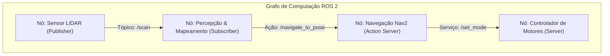
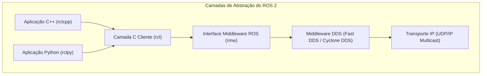

# Exercício 1: Arquitetura ROS 2 e Casos de Uso

---

## 1. Descrição da Arquitetura do ROS 2

O **ROS 2 (Robot Operating System 2)** foi projetado para superar as limitações de tempo real, segurança e escalabilidade do ROS 1. Sua arquitetura é fundamentada nos conceitos de **grafo de computação**, **comunicação por middleware DDS** e **processos distribuídos em nós independentes**.

---

### 1.1 Grafo de Computação em Alto Nível

O **Grafo de Computação** é a rede peer-to-peer de elementos computacionais que processam dados conjuntamente. No ROS 2, os principais elementos do grafo são:

- **Nós (Nodes):** Unidades fundamentais de processamento executável responsável por uma tarefa específica.
- **Tópicos (Topics):** Canais de comunicação unidirecionais baseados no padrão Publish-Subscribe para transmissão assíncrona de dados contínuos em fluxo (ex: leituras de sensores LiDAR ou comandos de velocidade).
- **Serviços (Services):** Mecanismos de comunicação síncrona/assíncrona do tipo Request-Response (Cliente-Servidor) para operações pontuais (ex: calibrar uma câmera ou resetar odometria).
- **Ações (Actions):** Mecanismos para tarefas de longa duração que exigem meta final, feedback contínuo durante a execução e capacidade de cancelamento (ex: navegação até um ponto distante).
- **Servidor de Parâmetros (Parameters):** Configurações dinâmicas associadas a nós individuais, permitindo alterar comportamentos em tempo de execução sem recompilar o código.

---

### 1.2 O Papel do Middleware DDS (Data Distribution Service)

Diferente do ROS 1 — que dependia de um nó mestre centralizador (`roscore`) —, o ROS 2 adota o padrão industrial **DDS (Data Distribution Service)**, normatizado pela OMG (Object Management Group).

#### Principais contribuições e papel do DDS:
1. **Descoberta Dinâmica Descentralizada (Discovery):** Não existe ponto único de falha. Os nós utilizam *UDP Multicast* para descobrir automaticamente outros nós, tópicos e tipos de mensagens na rede.
2. **Camada de Abstração Middleware (RMW):** O ROS 2 implementa a *ROS Middleware Interface (RMW)*, permitindo trocar o fornecedor DDS subjacente (ex: eProsima Fast DDS, Eclipse Cyclone DDS, RTI Connext) sem modificar o código do usuário.
3. **Políticas de Qualidade de Serviço (QoS):** Permite ajustar o comportamento da comunicação por canal:
   - **Reliability:** *Reliable* (garante entrega com confirmação) vs *Best Effort* (prioriza latência, aceitando perda de pacotes).
   - **Durability:** *Transient Local* (armazena histórico para novos inscritos) vs *Volatile* (dados apenas em tempo real).
   - **History & Depth:** Controle de buffer de mensagens.
   - **Liveliness & Deadline:** Monitoramento de nós ativos e prazos de comunicação para sistemas de tempo real rígido ou flexível.
4. **Suporte Multi-máquina Nativo:** Permite comunicação transparente entre nós executando em barramentos de hardware distintos (ex: Raspberry Pi no robô e estação de trabalho).

---

### 1.3 Organização do Sistema em Nós Independentes

Um sistema robótico em ROS 2 é construído através de **processos distribuídos e modulares**:

- **Encapsulamento e Responsabilidade Única:** Cada nó gerencia um único componente ou algoritmo (ex: nó de leitura da IMU, nó de odometria, nó de filtro de Kalman, nó de controle PID).
- **Tolerância a Falhas:** Se um nó específico falhar ou sofrer um *crash* (ex: driver da câmera), os demais nós continuam executando e o sistema pode reiniciar individualmente o nó com falha.
- **Gerenciamento de Ciclo de Vida (*Lifecycle Nodes / Managed Nodes*):** Nós configuráveis pelo ROS 2 possuem estados explícitos (*Unconfigured, Inactive, Active, Finalized*), garantindo que um nó só comece a publicar dados após todos os sensores e conexões estarem devidamente inicializados.
- **Portabilidade entre Hardware e Simulação:** Como a comunicação ocorre por tópicos com interfaces padronizadas (`sensor_msgs`, `geometry_msgs`), um nó de algoritmo de controle consome dados da mesma forma se a fonte for um nó de hardware real ou um nó simulador.

---

## 2. Casos de Uso Reais do ROS 2

### 2.1 Sistemas Robóticos Físicos

#### 1. Robôs Móveis Autônomos de Armazém (AMRs / AGVs)
- **Descrição:** Robôs utilitários operando em centros de distribuição logística para transporte autônomo de cargas e prateleiras.
- **Papel do ROS 2:** 
  - Utilização do framework **Nav2 (Navigation 2)** para planejamento de rotas globais e desvio de obstáculos dinâmicos em tempo real.
  - Ajuste de **QoS Best Effort** para streaming de alta frequência de dados LiDAR/Depth Camera e **QoS Reliable** para comandos críticos de velocidade (`cmd_vel`) e paradas de emergência.
  - Comunicação inter-processos com latência mínima e baixo *overhead* de memória através da funcionalidade de *Intra-Process Communication* do ROS 2.

#### 2. Braços Robóticos Industriais e Manipuladores Colaborativos (Cobots)
- **Descrição:** Manipuladores articulados aplicados em linhas de montagem, soldagem, paletização e tarefas de precisão (ex: Universal Robots, Franka Emika).
- **Papel do ROS 2:**
  - Integração com a pilha **MoveIt 2** para cinemática inversa, planejamento de trajetória espacial e desvio de colisões do atuador final.
  - Utilização do **ros2_control** para controle de malha fechada deterministicamente sincronizado com ciclos de hardware em tempo real (patch *PREEMPT_RT* do Linux).
  - Troca segura de comandos de junta via serviços e ações monitoradas com critérios de *Liveliness QoS*.

#### 3. Drones Autônomos e Veículos Aéreos Não Tripulados (VANTs)
- **Descrição:** Multirotores para inspeção de infraestrutura, mapeamento agrícola e entregas autônomas.
- **Papel do ROS 2:**
  - Integração leve entre placas de controle de voo embarcadas (ex: Pixhawk rodando PX4) e computadores de bordo (*Companion Computers*) utilizando o protocolo **Micro-XRCE-DDS** (ROS 2 para microcontroladores / Micro-ROS).
  - Execução distribuída de SLAM visual (vSLAM) e navegação tridimensional no computador de bordo, enviando Setpoints de posição/atitude diretamente para o piloto automático via tópicos ROS 2.

---

### 2.2 Sistemas Robóticos Simulados

#### 1. Validação de Software de Navegação e Percepção (Hardware-in-the-Loop / Software-in-the-Loop)
- **Descrição:** Teste de algoritmos de mapeamento, localização e decisão em ambientes virtuais altamente fiéis antes da implantação no robô físico.
- **Papel do ROS 2:**
  - Conexão nativa com simuladores como **Gazebo (Ignition)** ou **Isaac Sim**, onde sensores simulados (câmeras RGB-D, LiDAR 3D, IMU) publicam dados nas mesmas interfaces de mensagens (`sensor_msgs/msg/LaserScan`, `sensor_msgs/msg/Image`) do hardware real.
  - Validação da estabilidade da pilha robótica contra ruídos nos sensores e variações ambientais sem risco de acidentes mecânicos ou danos a equipamentos caros.

#### 2. Treinamento de Algoritmos de Aprendizado por Reforço (*Sim-to-Real*)
- **Descrição:** Treinamento de políticas de controle de locomoção quadrupede ou manipulação ágil através de milhões de iterações em ambiente simulado.
- **Papel do ROS 2:**
  - Intercalação entre o ambiente de simulação física e frameworks de Inteligência Artificial / Reinforcement Learning (ex: PyTorch/TensorFlow) utilizando nós ROS 2 em Python (`rclpy`).
  - Orquestração de serviços de reset de ambiente, injeção de parâmetros dinâmicos de atrito/massa e coleta de recompensas através de tópicos assíncronos.

#### 3. Testes de Regressão Automatizados e Integração Contínua (CI/CD)
- **Descrição:** Execução automática de testes de integração do sistema robótico completo a cada atualização no repositório de código.
- **Papel do ROS 2:**
  - Execução de cenários simulados *headless* (sem interface gráfica) dentro de contêineres Docker em servidores de integração contínua (ex: GitHub Actions ou GitLab CI).
  - Utilização do framework `launch_testing` e `ros2 test` para disparar sequências de cenários simulados, verificar se o robô atinge o objetivo esperado sem violar limites de aceleração ou colidir com paredes, e validar métricas de código antes da aprovação do *Pull Request*.
