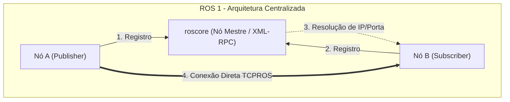

# Exercício 2: Comparação entre ROS 1 e ROS 2

---

## 1. Análise Técnica Comparativa da Arquitetura

A migração do ROS 1 para o ROS 2 representa uma mudança estrutural no paradigma de comunicação e controle para robótica. Enquanto o ROS 1 foi concebido principalmente para pesquisa acadêmica e prototipagem em redes locais controladas, o ROS 2 foi projetado para atender a requisitos industriais de missão crítica, operação distribuída, segurança cibernética e determinismo em tempo real.

---

## 2. Diferenças Arquiteturais Fundamentais

### 2.1 Descoberta e Comunicação: `roscore` (Centralizado) vs DDS Peer-to-Peer (Descentralizado)



```mermaid
graph TD
    subgraph ROS 2 - Arquitetura Descentralizada (DDS)
        DDSNode1["Nó A (eProsima Fast DDS)"]
        DDSNode2["Nó B (Cyclone DDS)"]
        
        DDSNode1 <==>|UDP Multicast Discovery & Dados| DDSNode2
    end
```

- **Limitação do ROS 1:** 
  O ROS 1 depende do `roscore` (servidor XML-RPC) como registrador centralizado de nomes e endereços. Se o `roscore` cair, perder conexão com a rede ou sofrer sobrecarga de CPU, o sistema perde a capacidade de registrar novos nós, reconfigurar conexões ou recuperar serviços. Trata-se de um **Ponto Único de Falha (Single Point of Failure - SPoF)**. Além disso, a comunicação multi-máquina exige configurações complexas e frágeis de variáveis de ambiente (`ROS_MASTER_URI` e `ROS_IP`).

- **Solução no ROS 2:** 
  O ROS 2 elimina o `roscore` e adota a arquitetura descentralizada **DDS (Data Distribution Service)** com o protocolo **RTPS (Real-Time Publish-Subscribe)**. A descoberta de nós e tópicos é totalmente peer-to-peer via *UDP Multicast*.

- **Exemplo Concreto em Produção:**
  Em uma frota de 20 Robôs Móveis Autônomos (AMRs) operando em um galpão logístico:
  - **No ROS 1:** Se a estação central que roda o `roscore` sofrer uma queda de energia ou desconexão Wi-Fi temporária, robôs que inicializarem ou precisarem reconectar serviços de mapeamento ficarão completamente paralisados sem conseguir descobrir outros nós.
  - **No ROS 2:** Cada AMR possui uma rede de nós independente que se descobre dinamicamente na rede Wi-Fi/5G industrial. A queda de qualquer nó ou computador não afeta a descoberta e comunicação entre os demais robôs da frota.

---

### 2.2 Qualidade de Serviço (QoS) e Suporte a Tempo Real (Real-Time)

- **Limitação do ROS 1:**
  O ROS 1 utiliza protocolos de transporte proprietários (*TCPROS* e *UDPROS*). O TCPROS impõe a sobrecarga da confirmação de entrega do TCP, gerando *latências imprevisíveis (jitter)* quando há perda de pacotes Wi-Fi. Não há mecanismos nativos para priorizar tráfego, limitar tamanho de buffers em memória ou definir prazos (*deadlines*) de resposta para malhas de controle determinísticas.

- **Solução no ROS 2:**
  O ROS 2 oferece suporte a perfis configuráveis de **QoS (Quality of Service)** por tópico e traz compatibilidade nativa com kernels de tempo real (ex: Linux com patch `PREEMPT_RT`). Através do perfil de QoS, o engenheiro define:
  - **Reliability:** `Best Effort` (descarta pacotes antigos em favor da menor latência) ou `Reliable` (garante entrega ordenada).
  - **Liveliness & Deadline:** Notifica o sistema se um nó produtor parar de publicar dentro do intervalo de tempo limite estipulado.
  - **History & Depth:** Controla exatamente quantas mensagens são retidas na fila de memória de entrada/saída.

- **Exemplo Concreto em Produção:**
  Em um braço robótico industrial executando uma malha de controle de torque de 1 kHz (1 milissegundo por ciclo):
  - **No ROS 1:** A transmissão de dados de sensores via TCPROS sob carga de CPU pode sofrer atrasos de retransmissão TCP de 10 a 50 ms. Isso estoura a janela de tempo do controlador, provocando vibrações mecânicas, erros de trajetória ou desligamentos de emergência da máquina.
  - **No ROS 2:** O tópico de estado de juntas utiliza QoS `Best Effort` combinado com o subsistema `ros2_control` e threads com prioridade de tempo real no kernel `PREEMPT_RT`. As leituras chegam com latência sub-milissegundo determinística, descartando pacotes obsoletos sem travar o loop de controle.

---

### 2.3 Segurança Ciber-Robótica: Autenticação, Criptografia e Controle de Acesso (SROS 2)

- **Limitação do ROS 1:**
  O ROS 1 não possui **nenhuma camada nativa de segurança**. Toda a comunicação entre nós é transmitida em texto plano sem autenticação. Qualquer dispositivo na mesma rede local pode injetar mensagens maliciosas nos tópicos (ex: `/cmd_vel`), ler dados confidenciais de câmeras ou disparar serviços não autorizados.

- **Solução no ROS 2:**
  O ROS 2 integra o padrão **SROS 2 (Secure ROS 2)** aproveitando a extensão **DDS-Security**. O SROS 2 fornece:
  - **Autenticação:** Validação da identidade de nós por certificados digitais X.509 e infraestrutura de chave pública (PKI).
  - **Criptografia:** Criptografia ponta a ponta dos dados transmitidos (utilizando TLS/DTLS e AES-GCM).
  - **Controle de Acesso (Access Control):** Políticas refinadas em XML que definem exatamente quais tópicos um nó tem permissão de publicar ou assinar.

- **Exemplo Concreto em Produção:**
  Em um robô cirúrgico ou AMR de inspeção industrial em ambiente público/compartilhado:
  - **No ROS 1:** Um invasor conectado à rede Wi-Fi da instalação pode capturar os pacotes de vídeo das câmeras do robô ou enviar um comando `rostopic pub /cmd_vel` ordenando o robô a se mover contra um obstáculo.
  - **No ROS 2:** Com SROS 2 ativado, mesmo que o invasor acesse o Wi-Fi, as mensagens de telemetria estarão criptografadas. Se ele tentar publicar comandos não autorizados, o middleware DDS rejeitará os pacotes imediatamente por ausência de um certificado digital assinado pela Autoridade Certificadora (CA) do sistema.

---

## 3. Matriz Comparativa Resumida

| Funcionalidade / Critério | ROS 1 (Noetic) | ROS 2 (Humble / Jazzy) | Impacto em Produção |
| :--- | :--- | :--- | :--- |
| **Arquitetura de Rede** | Centralizada (`roscore`) | Descentralizada (DDS Peer-to-Peer) | Elimina ponto único de falha e melhora escalabilidade |
| **Protocolo de Comunicação** | TCPROS / UDPROS (Proprietário) | DDS / RTPS (Padrão OMG Industrial) | Maior interoperabilidade e estabilidade de mercado |
| **Determinismo / Tempo Real** | Sem suporte nativo | Nativo (`PREEMPT_RT` + `ros2_control`) | Essencial para controle de atuadores e segurança |
| **Políticas de QoS** | Não possui (apenas tamanho de fila) | Completo (Reliability, Deadline, Durability) | Permite otimizar rede para sensores vs comandos |
| **Segurança Cibernética** | Ausente (Texto plano) | Nativo (SROS 2 / DDS-Security PKI) | Proteção contra invasões e sequestro de robôs |
| **Ciclo de Vida de Nós** | Inexistente (Início imediato) | *Managed / Lifecycle Nodes* explícitos | Inicialização segura e previsível de subsistemas |

---

## 4. Recomendação Técnica e Cenários de Transição

### 4.1 Recomendação Principal
A migração de sistemas legados para o **ROS 2 é altamente recomendada e mandatória para novos projetos em produção**. 
Com o **fim do suporte oficial (End-of-Life - EOL) do ROS 1 Noetic em Maio de 2025**, a plataforma ROS 1 não recebe mais atualizações de segurança nem correções de bugs.

### 4.2 Cenários onde ainda faria sentido manter o ROS 1 (Temporariamente)

Embora a migração seja a diretriz padrão, a permanência temporária no ROS 1 só é justificável sob as seguintes condições específicas:

1. **Dependência de Hardware Legado sem Drivers ROS 2:**
   - Robôs ou sensores proprietários antigos cujos fabricantes descontinuaram o suporte e cujos drivers em C++/Python existam unicamente para ROS 1.
   - *Mitigação recomendada:* Utilizar o pacote `ros1_bridge` para conectar o subsistema legado em ROS 1 à nova arquitetura em ROS 2, isolando o legado.

2. **Projetos Acadêmicos / Didáticos em Ambientes Isolados (*Air-Gapped*):**
   - Laboratórios de ensino onde o objetivo seja apenas demonstrar conceitos básicos de robótica em bancada, sem requisitos de tempo real, segurança cibernética ou operação 24/7.

3. **Custo Financeiro / ROI de Reescrita Inviável no Curto Prazo:**
   - Bases de código monolíticas massivas com alto grau de acoplamento a bibliotecas obsoletas do ROS 1, onde a reescrita imediata inviabilizaria o orçamento do produto. Nesses casos, recomenda-se um plano de migração modular por fases, mantendo o ROS 1 temporariamente isolado por uma ponte de comunicação.
