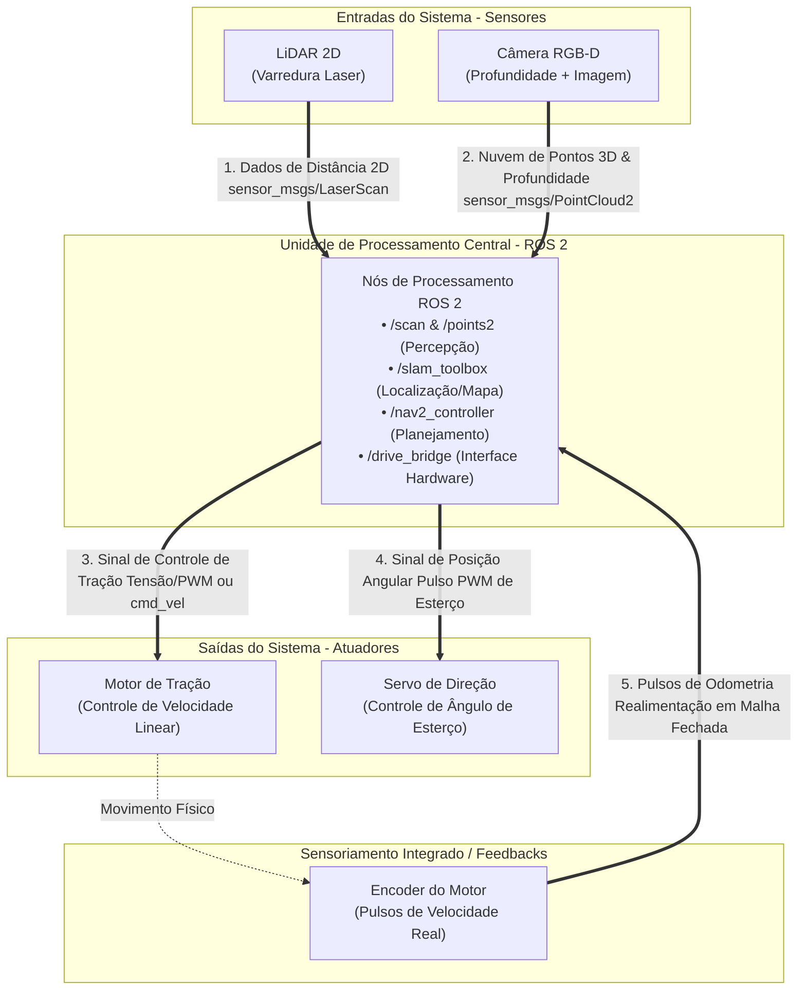

# Exercício 3: Sensores e Atuadores em Sistemas Robóticos

---

## 1. Mapeamento e Classificação de Componentes de Hardware

A integração entre o software de controle (ROS 2) e o mundo físico depende do correto mapeamento dos sinais de **sensores** (que convertem grandezas físicas do ambiente em dados de entrada para o sistema) e **atuadores** (que convertem comandos computacionais de saída em ação mecânica/física).

---

### 1.1 Tabela de Classificação de Componentes

| Componente | Sensor ou Atuador | Tipo de Dado (Contínuo / Discreto) | Aplicação Robótica Real |
| :--- | :--- | :--- | :--- |
| **LiDAR 2D** | Sensor | **Contínuo** (Fluxo temporal de varredura angular e distâncias) | Mapeamento 2D de ambientes (SLAM) e desvio de obstáculos dinâmicos em Robôs Móveis Autônomos (AMRs). |
| **IMU (Unidade de Medição Inercial)** | Sensor | **Contínuo** (Aceleração linear 3D e velocidade angular 3D em alta frequência) | Estimativa de orientação (Roll/Pitch/Yaw) e fusão de dados de odometria via Filtro de Kalman Estendido (EKF). |
| **Câmera RGB** | Sensor | **Contínuo** (Matriz densa de pixels 2D transmitida continuamente em quadros por segundo - FPS) | Reconhecimento de objetos, identificação de sinalizações visuais e rastreamento de alvos via Visão Computacional. |
| **Motor DC com Encoder** | Atuador + Sensor Integrado | **Discreto / Contínuo** (Recebe sinal contínuo/PWM de tensão e fornece pulsos digitais discretos de quadratura do encoder) | Tração diferencial de rodas em robôs móveis com controle de velocidade em malha fechada (PID). |
| **Servo Motor** | Atuador | **Discreto / Contínuo** (Recebe comandos discretos/PWM de posição angular de junta) | Controle de esterço/direção em veículos de geometria Ackermann ou movimentação de articulações de garras robóticas. |
| **Sensor Ultrassônico** | Sensor | **Discreto** (Pulsos de tempo de voo - ToF convertidos em valores de distância pontual) | Detecção de obstáculos de curto alcance e barreira de segurança para detecção de materiais transparentes (ex: vidros). |

---

### 1.2 Detalhamento Técnico das Classificações

- **Sinais Contínuos vs. Discretos no Contexto Robótico:**
  - **Sinais Contínuos:** Representam grandezas físicas que variam suavemente no tempo (aceleração, distância escalar contínua, stream de vídeo). No ROS 2, são amostrados a taxas de frequência fixas (ex: 100 Hz na IMU, 30 FPS na Câmera) e transmitidos como streams contínuos de mensagens (`sensor_msgs/msg/Imu`, `sensor_msgs/msg/Image`).
  - **Sinais Discretos:** Representam estados chaveados, eventos de contagem de pulsos (como as bordas de subida/descida do disco óptico do encoder) ou comandos em etapas discretas (como pulsos de largura modulada PWM para controle de servos e pontes H).

---

## 2. Fluxo de Dados do Sistema Robótico Móvel

Considerando um sistema robótico móvel constituído por:
1. **Sensor LiDAR 2D**
2. **Câmera RGB-D**
3. **Unidade de Processamento Central (SBC / PC embarcado)**
4. **Motor de Tração (Atuador 1)**
5. **Servo de Direção (Atuador 2)**

---

### 2.1 Diagrama do Fluxo de Informação (Arquitetura de Dados)

---

### 2.2 Descrição Textual Detalhada do Fluxo de Dados

#### A. Fluxo de Entrada (Sensores → Unidade de Processamento Central)

1. **Fluxo 1: LiDAR 2D → Unidade de Processamento Central (Direção: Entrada)**
   - **Descrição:** O sensor LiDAR realiza varreduras a laser em 360° no plano horizontal.
   - **Tipo de Informação:** Dados contínuos de distância e ângulo.
   - **Interface ROS 2:** Mensagem do tipo `sensor_msgs/msg/LaserScan`.
   - **Finalidade no Processamento:** Utilizado pelos nós de percepção e mapeamento (ex: `slam_toolbox`) para construir o mapa do ambiente e identificar a posição de obstáculos em relação ao robô.

2. **Fluxo 2: Câmera RGB-D → Unidade de Processamento Central (Direção: Entrada)**
   - **Descrição:** A câmera captura dados de cor (RGB) combinados com uma matriz de profundidade por pixel (D).
   - **Tipo de Informação:** Stream contínuo de dados densos de imagem e nuvem de pontos 3D.
   - **Interface ROS 2:** Mensagens `sensor_msgs/msg/Image` e `sensor_msgs/msg/PointCloud2`.
   - **Finalidade no Processamento:** Utilizado para detecção tridimensional de obstáculos acima ou abaixo do plano do LiDAR (ex: degraus, mesas) e identificação visual de objetos pelo algoritmo de navegação (`Nav2`).

---

#### B. Processamento Interno (Tomada de Decisão na Unidade Central)

- A **Unidade de Processamento Central** (executando o ambiente ROS 2 em Linux Ubuntu 22.04) recebe as entradas dos sensores, calcula a posição atual do robô no mapa e executa o algoritmo de planejamento de trajetória.
- O resultado do planejamento é convertido em comandos de movimento (velocidade linear $v$ e ângulo de esterço $\theta$).

---

#### C. Fluxo de Saída (Unidade de Processamento Central → Atuadores)

3. **Fluxo 3: Unidade de Processamento Central → Motor de Tração (Direção: Saída)**
   - **Descrição:** O nó de controle de hardware converte o comando de velocidade linear gerado pelo algoritmo em um sinal elétrico para a ponte H / driver do motor.
   - **Tipo de Informação:** Sinal discreto/modulado (sinal PWM de Duty Cycle ou comando de tensão via barramento industrial).
   - **Efeito Físico:** Altera a rotação das rodas motrizes, produzindo deslocamento para frente ou para trás.

4. **Fluxo 4: Unidade de Processamento Central → Servo de Direção (Direção: Saída)**
   - **Descrição:** O nó de interface envia o ângulo de esterço calculado para o servo motor encarregado da caixa de direção (geometria Ackermann).
   - **Tipo de Informação:** Sinal discreto (largura de pulso PWM correspondente ao ângulo desejado em graus/radianos).
   - **Efeito Físico:** Altera a orientação das rodas direcionais, definindo o raio de curvatura da trajetória do robô.

---

#### D. Fluxo de Realimentação (Atuador / Sensor Integrado → Unidade de Processamento)

5. **Fluxo 5 (Loop Fechado): Encoder do Motor → Unidade de Processamento Central (Direção: Entrada de Realimentação)**
   - **Descrição:** O encoder acoplado ao motor de tração envia pulsos elétricos conforme o eixo gira.
   - **Tipo de Informação:** Sinal discreto (contagem de pulsos de quadratura A/B).
   - **Finalidade:** Permite que a Unidade Central calcule a velocidade real exercida pelas rodas, ajustando o sinal do motor via controlador PID em malha fechada para corrigir derrapagens ou variações de carga.
