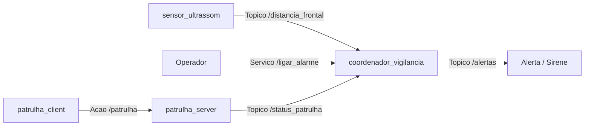

# Teste de Performance - TP3 [OBRIGATÓRIO]
**Disciplina:** Fundamentos de Sistemas Robóticos com ROS 2  
**Aluno:** Lucas Dias de Gondra  
**E-mail:** lucas.gondra@al.infnet.edu.br  

---

### Comandos de Compilação e Preparação do Workspace

```bash
cd /mnt/c/Users/Lucas/Documents/codes/BlocoRobotica/FundamentosSistemasRoboticos/tp3/tp1_ws
colcon build --packages-select comunicacao_ros2
source install/setup.bash
```

---

## Exercício 1: Estado completo do robô com mensagens padrão

### 1. Composição de Mensagens Padrão no ROS 2

Os pacotes de mensagens padrão no ROS 2 são usados para interoperabilidade imediata entre pacotes comunitários, ferramentas de visualização como RViz2 e stacks de navegação autônoma como Nav2, criando um padrão base de mensageria que pode depois ser implementado em outros robôs.

Para representar um robô, usamos esses pacotes padrão:

- **std_msgs**: Usado para tipos primitivos simples e comunicação básica desacoplada de espaço. Serve para telemetrias e flags simples. No nosso robô, usamos `std_msgs/msg/Float32` no tópico `/bateria` para publicar a porcentagem de carga de 0 a 100, e `std_msgs/msg/String` no tópico `/status` para dizer se o robô está operando ou com bateria crítica.

- **geometry_msgs**: Usado para grandezas espaciais e cinemáticas como posições e velocidades. Usamos `geometry_msgs/msg/Pose2D` no tópico `/pose` para indicar a posição com coordenadas x, y e o ângulo theta, e `geometry_msgs/msg/Twist` no tópico `/velocidade` com velocidade linear x de 0.3 m/s para movimentação do robô.

- **sensor_msgs**: Usado para dados vindos de sensores com informações de tempo e referencial físico. Serve para sensores como LiDAR com `sensor_msgs/msg/LaserScan` trazendo as distâncias lidas em cada ângulo, ou baterias reais com `sensor_msgs/msg/BatteryState` trazendo tensão, corrente e carga restante.

- **nav_msgs**: Usado para navegação autônoma e mapeamento. Serve para estimar a odometria com `nav_msgs/msg/Odometry` integrando posição e velocidade com matriz de incerteza, além de mapas de ocupação com `nav_msgs/msg/OccupancyGrid` e trajetórias planejadas com `nav_msgs/msg/Path`.

---

### 2. Implementação: `estado_robo.py`

O nó foi implementado no pacote `comunicacao_ros2`, publicando a cada 1 segundo os quatro tópicos solicitados com incremento contínuo de x e decremento da bateria com chaveamento de status:

```python
import rclpy
from rclpy.node import Node
from geometry_msgs.msg import Pose2D, Twist
from std_msgs.msg import Float32, String


class EstadoRobo(Node):
    def __init__(self):
        super().__init__("estado_robo")
        self.pub_pose = self.create_publisher(Pose2D, "/pose", 10)
        self.pub_vel = self.create_publisher(Twist, "/velocidade", 10)
        self.pub_bateria = self.create_publisher(Float32, "/bateria", 10)
        self.pub_status = self.create_publisher(String, "/status", 10)
        self.x = 0.0
        self.bateria = 100.0
        self.create_timer(1.0, self.tick)
        self.get_logger().info("No estado_robo inicializado")

    def tick(self):
        pose = Pose2D()
        self.x += 0.1
        pose.x = self.x
        self.pub_pose.publish(pose)

        vel = Twist()
        vel.linear.x = 0.3
        self.pub_vel.publish(vel)

        self.bateria = max(0.0, self.bateria - 2.0)
        bat_msg = Float32()
        bat_msg.data = self.bateria
        self.pub_bateria.publish(bat_msg)

        status = String()
        status.data = "bateria_critica" if self.bateria < 20.0 else "operando"
        self.pub_status.publish(status)

        self.get_logger().info(
            f"x: {self.x:.2f} | vel: {vel.linear.x} | bat: {self.bateria:.1f}% | status: {status.data}"
        )


def main(args=None):
    rclpy.init(args=args)
    node = EstadoRobo()
    try:
        rclpy.spin(node)
    except KeyboardInterrupt:
        pass
    finally:
        node.destroy_node()
        rclpy.shutdown()


if __name__ == "__main__":
    main()
```

---

### 3. Validação e Evidências de Execução

**Comandos para teste:**
```bash
ros2 run comunicacao_ros2 estado_robo
ros2 topic list
ros2 topic echo /status
```

**Evidências esperadas:**
- Saída do comando `ros2 topic list` exibindo os tópicos:
  - `/pose`
  - `/velocidade`
  - `/bateria`
  - `/status`
- Saída do comando `ros2 topic echo /status` registrando a mensagem `data: "operando"` e, após a bateria atingir valor inferior a 20.0, a transição automática para `data: "bateria_critica"`.

Inserir prints do terminal comprovando a listagem dos quatro tópicos e a transição de status:

---

## Exercício 2: Controlador com serviço, estado interno e MultiThreadedExecutor

### 1. Estado Interno, Concorrência e Proteção com `threading.Lock`

Em nós ROS 2 Python criados com `rclpy`, o nó é uma classe onde os atributos guardados em `self`, como `self.estado = 'parado'`, permanecem na memória durante todo o ciclo de vida do nó. Com isso, qualquer serviço, timer ou subscriber consegue ler e alterar essas variáveis entre uma chamada e outra. Porém, ao usar o `MultiThreadedExecutor`, múltiplos callbacks rodam em paralelo em threads diferentes. Se uma requisição de serviço tentar mudar o estado para movendo no mesmo instante em que a leitura de bateria baixa tenta acionar a emergência, ocorre uma condição de corrida onde duas threads tentam mexer na mesma variável ao mesmo tempo, colocando a segurança do robô em risco.

Para evitar esse problema, usamos o `threading.Lock` para criar exclusão mútua em volta do estado compartilhado. Criamos uma instância do lock no construtor do nó e envolvemos todas as leituras e alterações de `self.estado` dentro do bloco `with self.lock:`. Dessa forma, apenas uma thread acessa a variável por vez, garantindo que a transição para emergência seja atômica e impedindo que comandos externos de movimento sobrescrevam uma situação crítica.

---

### 2. Implementação: `controlador.py`

```python
import threading
import rclpy
from rclpy.node import Node
from rclpy.executors import MultiThreadedExecutor
from std_srvs.srv import SetBool
from std_msgs.msg import Float32
from geometry_msgs.msg import Twist


class Controlador(Node):
    def __init__(self):
        super().__init__("controlador")
        self.lock = threading.Lock()
        self.estado = "parado"
        self.srv = self.create_service(
            SetBool, "/mudar_estado", self.mudar_estado_callback
        )
        self.sub_bateria = self.create_subscription(
            Float32, "/bateria", self.bateria_callback, 10
        )
        self.pub_cmd = self.create_publisher(Twist, "/cmd_vel", 10)
        self.create_timer(0.5, self.publicar_cmd_vel)
        self.get_logger().info("No controlador inicializado")

    def mudar_estado_callback(self, request, response):
        with self.lock:
            if self.estado == "emergencia":
                response.success = False
                response.message = "Robo em emergencia, bateria critica. Comando ignorado."
            else:
                self.estado = "movendo" if request.data else "parado"
                response.success = True
                response.message = f"Estado alterado para {self.estado}"
        self.get_logger().info(response.message)
        return response

    def bateria_callback(self, msg):
        with self.lock:
            if msg.data < 20.0 and self.estado != "emergencia":
                self.estado = "emergencia"
                self.get_logger().warn(
                    f"BATERIA CRITICA {msg.data:.1f}%: Transicao para emergencia"
                )

    def publicar_cmd_vel(self):
        with self.lock:
            estado_atual = self.estado
        msg = Twist()
        msg.linear.x = 0.5 if estado_atual == "movendo" else 0.0
        self.pub_cmd.publish(msg)


def main(args=None):
    rclpy.init(args=args)
    node = Controlador()
    executor = MultiThreadedExecutor()
    executor.add_node(node)
    try:
        executor.spin()
    except KeyboardInterrupt:
        pass
    finally:
        executor.shutdown()
        node.destroy_node()
        rclpy.shutdown()


if __name__ == "__main__":
    main()
```

---

### 3. Validação e Evidências de Execução

**Comandos para teste:**
```bash
ros2 run comunicacao_ros2 estado_robo
ros2 run comunicacao_ros2 controlador
ros2 service call /mudar_estado std_srvs/srv/SetBool "{data: true}"
ros2 topic echo /cmd_vel
```

**Evidências esperadas:**
- Resposta de sucesso ao chamar `/mudar_estado` indicando estado alterado para movendo.
- O comando `/cmd_vel` passa a publicar linear x em 0.5.
- Quando o tópico `/bateria` publicar valor abaixo de 20.0, o terminal do controlador imprime advertência da transição para emergencia.
- O tópico `/cmd_vel` volta automaticamente a publicar linear x em 0.0.

Inserir prints do terminal comprovando a ativação pelo serviço e a transição para emergência com parada de velocidade:

---

## Exercício 3: Ação ROS 2 para tarefa de longa duração com feedback

### 1. Estrutura de Ações e Fluxo em Python

- **As três fases de uma ação no ROS 2:**
  1. **Goal ou Meta:** O cliente envia o pedido da tarefa com os parâmetros necessários, como fazer uma rota com N pontos. O servidor decide se aceita ou rejeita o pedido.
  2. **Feedback:** Durante a execução da tarefa longa, o servidor vai avisando o cliente sobre o progresso passo a passo, sem travar o programa.
  3. **Result ou Resultado:** Quando a tarefa termina, o servidor devolve a resposta final dizendo se concluiu com sucesso ou se foi cancelada.

- **Fluxo do Action Server em Python:**
  No servidor, criamos o `ActionServer` apontando para o método `execute_callback`. Dentro do loop que percorre os pontos da rota, o nó checa a cada passo se o cliente pediu cancelamento via `goal_handle.is_cancel_requested`. Se pediu, cancela com `goal_handle.canceled` e encerra. Se não pediu, espera um segundo com `time.sleep`, envia o feedback com `goal_handle.publish_feedback` e, ao terminar todos os pontos, marca sucesso com `goal_handle.succeed` e retorna o resultado final.

- **Por que o Action Server precisa do `MultiThreadedExecutor`:**
  Como o `execute_callback` da ação demora bastante tempo rodando loops e pausas, se usássemos um executor de thread única o nó ficaria travado ali dentro. Com isso, ele não conseguiria receber o pedido de cancelamento do cliente nem atender outros tópicos. Com o `MultiThreadedExecutor`, o loop da ação roda em uma thread separada e as outras threads continuam livres para receber o cancelamento ou outras mensagens.

---

### 2. Implementação: `patrulha_server.py` e `patrulha_client.py`

#### `patrulha_server.py`
```python
import time
import rclpy
from rclpy.action import ActionServer
from rclpy.executors import MultiThreadedExecutor
from rclpy.node import Node
from example_interfaces.action import Fibonacci


class PatrulhaServer(Node):
    def __init__(self):
        super().__init__("patrulha_server")
        self._action_server = ActionServer(
            self, Fibonacci, "patrulha", self.execute_callback
        )
        self.get_logger().info("Action Server patrulha_server inicializado")

    def execute_callback(self, goal_handle):
        n = goal_handle.request.order
        self.get_logger().info(f"Executando rota com {n} pontos")
        feedback_msg = Fibonacci.Feedback()
        feedback_msg.sequence = []

        for i in range(1, n + 1):
            if goal_handle.is_cancel_requested:
                goal_handle.canceled()
                self.get_logger().warn("Patrulha cancelada")
                result = Fibonacci.Result()
                result.sequence = feedback_msg.sequence
                return result

            time.sleep(1.0)
            feedback_msg.sequence.append(i)
            self.get_logger().info(f"Visitando ponto {i} de {n}")
            goal_handle.publish_feedback(feedback_msg)

        goal_handle.succeed()
        result = Fibonacci.Result()
        result.sequence = feedback_msg.sequence
        self.get_logger().info("Patrulha concluida com sucesso")
        return result


def main(args=None):
    rclpy.init(args=args)
    node = PatrulhaServer()
    executor = MultiThreadedExecutor()
    executor.add_node(node)
    try:
        executor.spin()
    except KeyboardInterrupt:
        pass
    finally:
        node.destroy_node()
        rclpy.shutdown()


if __name__ == "__main__":
    main()
```

#### `patrulha_client.py`
```python
import sys
import rclpy
from rclpy.action import ActionClient
from rclpy.node import Node
from example_interfaces.action import Fibonacci


class PatrulhaClient(Node):
    def __init__(self):
        super().__init__("patrulha_client")
        self._client = ActionClient(self, Fibonacci, "patrulha")
        self.n = 3

    def send_goal(self, n):
        self.n = n
        goal_msg = Fibonacci.Goal()
        goal_msg.order = n

        self.get_logger().info("Aguardando Action Server patrulha...")
        self._client.wait_for_server()

        future = self._client.send_goal_async(
            goal_msg, feedback_callback=self.feedback_callback
        )
        future.add_done_callback(self.goal_response_callback)

    def goal_response_callback(self, future):
        goal_handle = future.result()
        if not goal_handle.accepted:
            self.get_logger().warn("Goal rejeitado pelo servidor")
            rclpy.shutdown()
            return

        self.get_logger().info("Goal aceito pelo servidor")
        result_future = goal_handle.get_result_async()
        result_future.add_done_callback(self.get_result_callback)

    def feedback_callback(self, feedback_msg):
        n_visitados = len(feedback_msg.feedback.sequence)
        self.get_logger().info(f"Visitando ponto {n_visitados} de {self.n}")

    def get_result_callback(self, future):
        result = future.result().result
        self.get_logger().info(f"Resultado final recebido: {result.sequence}")
        rclpy.shutdown()


def main(args=None):
    rclpy.init(args=args)
    client = PatrulhaClient()

    target_points = 3
    if len(sys.argv) > 1 and sys.argv[1].isdigit():
        target_points = int(sys.argv[1])

    client.send_goal(target_points)

    try:
        rclpy.spin(client)
    except (KeyboardInterrupt, ExternalShutdownException):
        pass
    finally:
        client.destroy_node()
        if rclpy.ok():
            rclpy.shutdown()


if __name__ == "__main__":
    from rclpy.executors import ExternalShutdownException

    main()
```

---

### 3. Validação e Evidências de Execução

**Comandos para teste:**
```bash
ros2 run comunicacao_ros2 patrulha_server
ros2 action list
ros2 action info /patrulha
ros2 run comunicacao_ros2 patrulha_client 3
```

**Evidências esperadas:**
- `ros2 action list` exibe a ação `/patrulha`.
- O cliente exibe no terminal:
  - `Visitando ponto 1 de 3`
  - `Visitando ponto 2 de 3` após 1 segundo
  - `Visitando ponto 3 de 3` após 1 segundo
  - `Resultado final recebido: [1, 2, 3]`

Inserir prints do terminal comprovando a listagem da ação e a execução do cliente com feedbacks e resultado final:

---

## Exercício 4: Sistema modular de vigilância com múltiplos mecanismos

### 1. Projeto de Arquitetura do Sistema de Vigilância

Para montar o sistema de vigilância, combinamos tópicos, serviços e ações conforme a necessidade de cada função:



#### Especificação dos Componentes

- **a. Leitura de distância frontal:**
  - **Nó:** `sensor_ultrassom.py`
  - **Mecanismo e canal:** Tópico Publisher `/distancia_frontal`
  - **Tipo de mensagem:** `sensor_msgs/msg/Range`
  - **Justificativa:** Tópicos são ideais para envio contínuo de dados de sensores com frequência constante. A mensagem `Range` já traz o campo de visão e os limites de leitura do sensor.

- **b. Ligar ou desligar alarme:**
  - **Nó:** `coordenador_vigilancia.py`
  - **Mecanismo e canal:** Serviço Server `/ligar_alarme`
  - **Tipo de mensagem:** `std_srvs/srv/SetBool`
  - **Justificativa:** Serviços são indicados para comandos pontuais onde precisamos de confirmação imediata se o alarme foi ligado ou desligado com sucesso.

- **c. Patrulha de rota:**
  - **Nó:** `patrulha_server.py`
  - **Mecanismo e canal:** Ação Server `/patrulha`
  - **Tipo de mensagem:** `example_interfaces/action/Fibonacci`
  - **Justificativa:** Ações são feitas para tarefas demoradas onde precisamos acompanhar o progresso passo a passo e ter a opção de cancelar a patrulha se um intruso for visto.

- **d. Publicação de status geral:**
  - **Nó:** `coordenador_vigilancia.py`
  - **Mecanismo e canal:** Tópico Publisher `/alertas` e `/status_geral`
  - **Tipo de mensagem:** `std_msgs/msg/String`
  - **Justificativa:** Tópicos permitem espalhar avisos como INTRUSO DETECTADO para qualquer painel ou nó que queira ouvir, sem travar o sistema.

---

### 2. Implementação: `coordenador_vigilancia.py`

```python
import threading
import rclpy
from rclpy.node import Node
from rclpy.executors import MultiThreadedExecutor
from sensor_msgs.msg import Range
from std_msgs.msg import String
from std_srvs.srv import SetBool


class CoordenadorVigilancia(Node):
    def __init__(self):
        super().__init__("coordenador_vigilancia")
        self.lock = threading.Lock()
        self.alarme_ativo = False

        self.sub_dist = self.create_subscription(
            Range, "/distancia_frontal", self.distancia_callback, 10
        )
        self.sub_status = self.create_subscription(
            String, "/status_patrulha", self.status_callback, 10
        )
        self.srv_alarme = self.create_service(
            SetBool, "/ligar_alarme", self.ligar_alarme_callback
        )
        self.pub_alertas = self.create_publisher(String, "/alertas", 10)
        self.get_logger().info("No coordenador_vigilancia inicializado")

    def ligar_alarme_callback(self, request, response):
        with self.lock:
            self.alarme_ativo = request.data
            estado = "ativado" if self.alarme_ativo else "desativado"
        response.success = True
        response.message = f"Alarme {estado}"
        self.get_logger().info(response.message)
        return response

    def distancia_callback(self, msg):
        with self.lock:
            alarme_ligado = self.alarme_ativo

        if msg.range < 0.5 and alarme_ligado:
            alerta = String()
            alerta.data = "INTRUSO DETECTADO"
            self.pub_alertas.publish(alerta)
            self.get_logger().warn(
                f"INTRUSO DETECTADO! Distancia frontal: {msg.range:.2f} m"
            )

    def status_callback(self, msg):
        self.get_logger().info(f"Status da patrulha: {msg.data}")


def main(args=None):
    rclpy.init(args=args)
    node = CoordenadorVigilancia()
    executor = MultiThreadedExecutor()
    executor.add_node(node)
    try:
        executor.spin()
    except KeyboardInterrupt:
        pass
    finally:
        executor.shutdown()
        node.destroy_node()
        rclpy.shutdown()


if __name__ == "__main__":
    main()
```

---

### 3. Validação e Evidências de Execução

**Comandos para teste:**
```bash
ros2 run comunicacao_ros2 coordenador_vigilancia
ros2 topic echo /alertas
ros2 service call /ligar_alarme std_srvs/srv/SetBool "{data: true}"
ros2 topic pub --once /distancia_frontal sensor_msgs/msg/Range "{range: 0.3}"
```

**Evidências esperadas:**
- A chamada de serviço `/ligar_alarme` retorna sucesso com mensagem indicando alarme ativado.
- A publicação de distância 0.3 m dispara imediatamente o callback do coordenador, que emite no terminal o aviso de intruso detectado com a respectiva distância frontal.
- O comando `ros2 topic echo /alertas` registra a mensagem recebida com o texto INTRUSO DETECTADO.

Inserir prints do terminal comprovando a chamada do serviço, a publicação do valor no tópico de distância e a mensagem recebida em /alertas:
